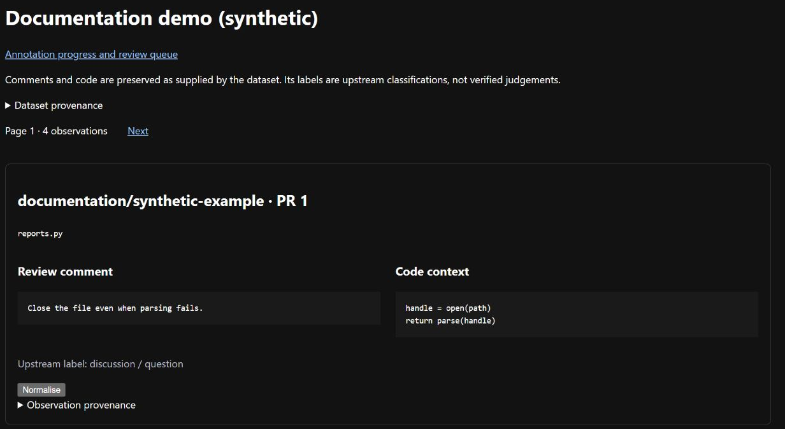

# Meerkritic

**Code review grounded in engineering evidence.**

Meerkritic explores how recurring concerns in code reviews, issue discussions and
source code can become reusable checks. It is an experimental project for
developers and researchers who want to understand why a finding matters and
whether a proposed change improves the code.

Its design centres on three ideas:

- **Traceable evidence.** Connect observations, rules and findings to the material
  that supports them.
- **Inspectable checks.** Express concerns as explicit rules, using deterministic
  tools where sufficient and model-assisted analysis where needed.
- **Human judgement.** Make interpretations available for review and correction,
  and evaluate proposed fixes against the code and its tests.



Browse comments alongside their code, then request an interpretation. This screenshot
uses a [synthetic demonstration](docs/images/README.md), not the public sample below.

## Browse the sample

You need **Python 3.12** and **uv**. Run commands from the repository root.
The browser is a local web application, called the *harness* in some project records.

1. Install the locked dependencies:

   ```text
   uv sync --locked
   ```

2. Download and register the public review-comment sample:

   ```text
   uv run --locked python tools/run.py --data-root ../extras/runtime register crc-py-manual-4176ac0
   ```

   This downloads about 2.5 MB, checks its checksum and registers 1,030 records.
   Keep the data directory outside the repository and use the same path throughout.

3. Start the web application:

   ```text
   uv run --locked python tools/run.py --data-root ../extras/runtime serve
   ```

4. Open [localhost:8000](http://127.0.0.1:8000) and choose the dataset to browse
   comments alongside their code. The server accepts connections on this computer only.

## What would you like to do?

| Task | Guide |
| --- | --- |
| Turn a comment and its code into a structured interpretation | [Run normalisation](docs/development/normalisation.md) |
| Accept, correct or reject a model interpretation | [Review annotations](docs/development/annotations.md) |
| Save fixed inputs for discovery | [Select annotations](docs/development/selections.md) |
| Group similar concerns | [Run discovery](docs/development/discovery.md) |
| Propose and challenge a reusable check | [Review candidate rules](docs/development/rules.md) |
| Save several decisions or ask the model for advice | [Use the review workspace](docs/development/research-interaction.md) |
| Inspect changes to the code's architecture | [Publish and read architecture views](docs/architecture/README.md) |

Model work needs a separate local model server and worker; browsing does not.
Agent advice never applies rule edits or human decisions automatically.
See the [documentation index](docs/README.md) for setup, operations and developer references.

## Contributing

- Use [GitHub issues](https://github.com/FinnNk/Meerkritic/issues) to ask questions,
  report problems or suggest improvements.
- Read the [project instructions](AGENTS.md) and [development guide](docs/development/README.md).
- Work on a branch, use Conventional Commits and run
  `uv run --locked python tools/check.py` before submitting changes for review.

## Licence

Meerkritic is licensed under the [MIT licence](LICENSE.md), copyright 2026 Finn Newick.
Imported material and third-party skills retain their own notices; see
[source attribution](docs/sources.md).
