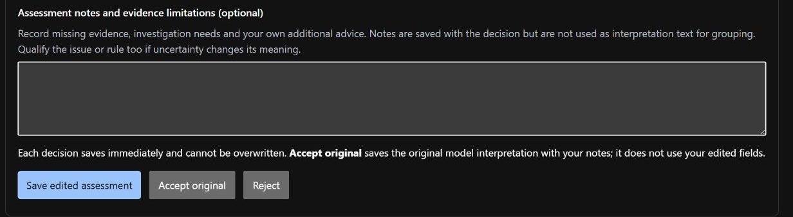

# Review model interpretations

An *annotation* is your decision on one model output. Successful interpretations
offer **Accept original**, **Save edited assessment** or **Reject**; retained failed drafts offer correction or rejection. Each model run has its own decision; reviewing several runs for
one source still counts as reviewing one original observation.

## Review a result

First [run normalisation](normalisation.md) and open the job. For a failed draft,
follow [correction and rejection](failed-drafts.md); infrastructure failures have
no interpretation to assess.

1. Read the open source panel, then assess the interpretation using the
   [field guide](assessment-fields.md). Impact scope describes affected code;
   investigation needs and missing evidence belong in notes.
2. Choose an action:

   | Action | What is saved |
   | --- | --- |
   | **Accept original** | Your acceptance of the model's original interpretation |
   | **Save edited assessment** | A complete corrected interpretation, alongside the original |
   | **Reject** | Your rejection; the source counts as reviewed, not accepted |

3. To correct the interpretation, use the labelled text fields, dropdowns and
   list controls. Follow [editing an assessment](assessment-form.md) for the steps.
   Invalid drafts stay visible for correction.
4. Add evidence limitations, investigation needs and any additional advice to
   **Assessment notes and evidence limitations**. Attribute advice beyond the
   source to yourself; notes are not interpretation text for grouping.
5. Review the entries in this tab, then submit the decision. It is saved immediately; there is no draft/apply stage for
   source annotations. The page shows your decision separately from the model result.
6. Open **Annotation progress and review queue** to find unreviewed outputs or
   inspect failures. For a study, follow its prepared order instead of this queue.

An identical retry returns the saved decision. A different decision for the same
result is refused. Source annotations cannot currently be reopened; the
[review workspace](research-interaction.md) reopens **rule reviews**, not annotations.
Edits belong to the current tab until submitted. A second tab does not contain
your unsaved changes. Check the saved interpretation and notes after submission.


The [synthetic demonstration](../images/README.md) is awaiting a decision.
List controls do not save a judgement; the three decision buttons do.



## Read progress and history

| Display | Meaning |
| --- | --- |
| Successful results | Reviewed successful runs out of all successful runs |
| Reviewed failed outputs | Reviewed failed runs out of all failed runs; some failures have no reviewable draft |
| Reviewed results | Total outputs with a decision, including corrected or rejected failures |
| Source coverage | Distinct original observations reviewed, regardless of repeat runs |
| Source history | The latest 100 decisions for that source across model runs |

Pending pages can shift as decisions are saved. Return to the first page to refresh
that queue. Progress counts come from one consistent database snapshot.

## Use the command line

Run from the repository root after `uv sync --locked`, using the same external
data directory as the web application. Copy the job ID from its page or the `jobs` command.

```text
uv run --locked python tools/run.py --data-root ../extras/runtime annotate <job-id> accept
uv run --locked python tools/run.py --data-root ../extras/runtime annotate <job-id> reject
uv run --locked python tools/run.py --data-root ../extras/runtime annotate <job-id> edit --edited-json <file> --notes "Reason for the correction"
uv run --locked python tools/run.py --data-root ../extras/runtime progress <dataset-id>
```

Choose one annotation command per result. For an edit, `<file>` must contain the
complete interpretation, not just changed fields. The command prints the saved
annotation; `progress` reports result counts and distinct-source coverage.

## Retention and recovery

- The original result and its evidence are never overwritten. Edited JSON bodies
  are immutable files; SQLite stores their references, decision metadata and events.
- A decision and its event are saved together. An interrupted file write cannot
  publish a partial decision, although a complete unreferenced file may remain.
- Preserve unexpected files for diagnosis. See [operational evidence](operational-evidence.md).
- The application is for one local reviewer. A recorded name or decision is not
  authenticated proof of who performed the review. Automated test decisions must
  remain labelled test data; see [research selections](selections.md#use-human-reviewed-data).
