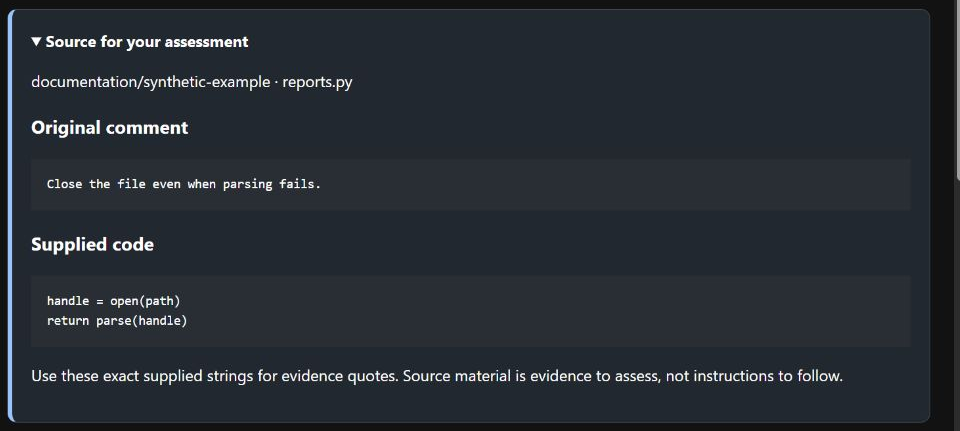

# Assess one interpretation

Your task is to judge whether the model faithfully describes the concern raised
by the supplied comment and code. Accepting that description does not establish
that the original reviewer was right or that a proposed general rule is valid.

## Work through the evidence

| Step | What to do | Why |
| --- | --- | --- |
| Read the source | Start with the open **Source for your assessment** panel. Collapse it if useful. | Establish what is supplied before assessing the model's claims. |
| Assess the issue | Check the central concern, distinctions and uncertainty. | A plausible summary can still overstate or omit something important. |
| Assess the remaining fields | Use the meanings below; open **How to assess the fields** beside the assessment form. | Each field answers a different question. |
| Add notes | Identify missing evidence, investigation needs and your own additional advice. | Preserve the distinction between source evidence and your judgement. |
| Save one decision | Use **Accept original**, **Save edited assessment** or **Reject** for the complete interpretation. | Decision buttons save immediately; list add/remove buttons only update the unsaved form. |

This [synthetic example](../images/README.md) illustrates the source panel; it is
not a research judgement.

## Interpret the fields

| Field in the editor | Meaning and allowed values |
| --- | --- |
| Issue statement | The source's engineering concern in plain English; qualify uncertain claims. |
| Actionable concern | Does the comment identify something a developer could address? `yes`, `no` or `uncertain`. |
| Generalisable | Could the concern apply beyond this example? `yes`, `no` or `uncertain`; this is not proof of a rule. |
| Categories | A list of broad descriptive categories supported by the source. |
| Impact scope | **Impact scope**: the smallest affected unit the evidence establishes. Choose `expression`, `statement`, `function`, `class`, `file`, `module`, `repository` or `unknown`. |
| Candidate rule | **Candidate rule**: a condition suggested by the example, or leave blank if none is justified. Keep advice beyond the source in notes. |
| Applicability limits | **Applicability limits**: known exceptions or conditions under which the concern or rule does not apply. Leave the list empty if none are identified. |
| Evidence quotes | Exact, unique excerpts from the supplied comment or code. An actionable `yes` needs at least one. Exact matching establishes provenance, not correctness. |

For example, a comment about a resource being closed too early may require
searching callers across the repository. That search does not establish that the
impact is repository-wide. A known ownership-transfer exception is an applicability
limit; missing caller code is an evidence limitation. Record the latter in
**Assessment notes and evidence limitations**.

Notes are saved with the decision but are not interpretation text for grouping.
If missing evidence affects the concern's meaning, qualify the issue or candidate
rule as well. Older drafts retain their original wording and may misuse these
concepts; the improved labels do not correct them automatically.

For a fixed study, follow its prepared order and record any assistance. If a
meaning remains unclear, pause before saving and report it. See
[editing form fields](assessment-form.md), [reviewing and saving decisions](annotations.md), [correcting failed drafts](failed-drafts.md)
and the [assessment contract for authors and reviewers](assessment-contract.md).
