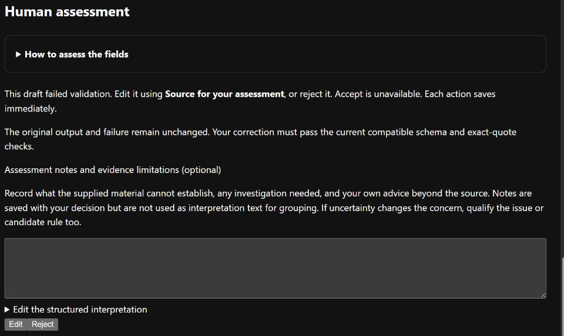

# Correct or reject a failed draft

A failed draft is text returned by the model that did not pass the interpretation
schema or source-evidence checks. You can correct it or reject it. Your decision is
stored separately; the model job, original text and failure remain unchanged.

## Review the source, then decide

| Step | What to do |
| --- | --- |
| Open the job | Read the failure message. **Edit** and **Reject** appear only when a retained semantic draft is available. |
| Read the source | Read the open **Source for your assessment** panel. Read the original comment and supplied code; neither is an instruction for you or the agent to execute. |
| Compare the draft | Check whether it describes the actual concern and whether the quoted text supports that interpretation. A quote match alone does not make the claim correct. |
| Edit | Correct the JSON in **Edit the structured interpretation**, then select **Edit**. Keep the full structure, including fields you did not change. |
| Reject | If the draft cannot serve the study, add a short reason in **Notes** and select **Reject**. You do not need to fix its JSON first. |
| Check the saved result | The page shows your decision and, for an edit, your interpretation. The original model failure remains visible. Each button saves immediately. |

**Accept is unavailable for a failed draft.** Do not rerun the model just to obtain
a more convenient interpretation. Provider, interrupted and missing-output failures
have no reviewable draft; they remain available for inspection.



The [synthetic demonstration](../images/README.md) is awaiting correction. Its
editor was collapsed for this image; it opens by default and retains the original
failed draft. Read [the assessment field guide](assessment-fields.md) for the
distinction between impact, applicability and evidence limitations.

## What the JSON fields mean

| Field | Your judgement |
| --- | --- |
| `actionable_engineering_concern` | Does the source identify an engineering concern? Use `yes`, `no` or `uncertain`. |
| `issue_statement` | State the concern in plain language without inventing requirements. |
| `coarse_categories` | A short list of descriptive categories; retain the JSON array. |
| `scope` | Smallest affected code unit supported by the evidence: `expression`, `statement`, `function`, `class`, `file`, `module`, `repository` or `unknown`. Investigation extent belongs in notes. |
| `generalisable` | Could the concern apply beyond this instance? Use `yes`, `no` or `uncertain`. |
| `proposed_invariant` | A condition that should hold, or `null` when none is justified. |
| `evidence_quotes` | Quote exact, unique text from `comment` or `code`. A `yes` actionable concern needs at least one quote. |
| `exclusions` | Known exceptions or conditions limiting applicability. Keep an empty array when none are identified; put missing evidence in notes. |

For example, if the supplied comment is `Close the file even when parsing fails.`,
this evidence entry identifies its exact text:

```json
{"source": "comment", "quote": "Close the file even when parsing fails."}
```

Use the text actually shown for your observation. Do not copy an illustrative quote
into a real decision. If a quote is ambiguous because it occurs more than once,
choose a longer excerpt that identifies the intended occurrence uniquely.

## If saving fails

- Read the error and correct the retained draft. Nothing is recorded until the
  schema and exact-source checks pass.
- If source or result files are unavailable or altered, stop and retain the error
  for investigation; do not bypass evidence checks.
- Retrying the same saved decision is safe. A different decision cannot overwrite
  it. Ask for an explicit correction procedure if you notice a mistake afterwards.

A human correction counts as a reviewed failed output, not a successful model run.
[Annotation progress](annotations.md#read-progress-and-history) keeps these counts
separate. For a study, follow its prepared input order and stopping rule rather than
the general review queue; see [input preparation](study-preparation.md).
