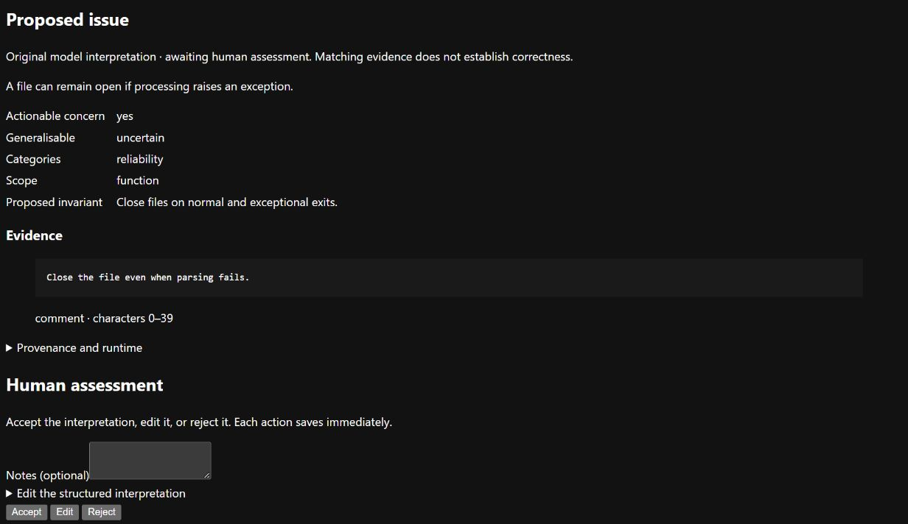

# Interpret a review comment with a local model

Normalisation turns a comment and its code excerpt into a structured interpretation:
what concern was raised, which evidence supports it and whether it might apply elsewhere.
You review the result; a successful model call does not establish that it is correct.

## Before you start

- Install Python 3.12 and run `uv sync --locked` from the repository root.
- [Register a dataset and start the web application](../../README.md#browse-the-sample).
- [Start the local generation server](local-inference.md) on port 8081.
- Use the same external data directory for the web application and worker.

## Submit and review a job

1. Start the worker in a separate terminal:

   ```text
   uv run --locked python tools/run.py --data-root ../extras/runtime worker --routing config/routing/llama-local.json
   ```

   Keep this terminal running. Use the [discovery worker](discovery.md#start-the-worker)
   instead if you also need grouping and rule synthesis; run only one worker per data directory.

2. In the web application, open a dataset and choose **Normalise** beside a record.
3. Open the resulting job page. It refreshes every three seconds while queued or running.
4. Read the interpretation, quoted evidence and available model usage. Unknown token
   counts display as `?`; local spend describes API spend, not hardware costs.
5. [Accept, edit or reject](annotations.md) a successful interpretation, or
   [correct or reject a retained failed draft](failed-drafts.md).
   **Normalisation jobs** lists recent and failed jobs.

Refreshing a result page does not submit another job. Pressing **Normalise** again
creates a separate model run.



Read the proposed issue and its evidence before choosing Accept, Edit or Reject.
The interpretation shown here was [prepared for the demonstration](../images/README.md);
it is not a model-quality result.

## Process one job from the command line

Stop the continuous worker first. These commands queue the first source record,
process at most one available job and list job results:

```text
uv run --locked python tools/run.py --data-root ../extras/runtime normalise crc-py-manual-4176ac0 0
uv run --locked python tools/run.py --data-root ../extras/runtime worker --routing config/routing/llama-local.json --once
uv run --locked python tools/run.py --data-root ../extras/runtime jobs
```

Source indexes start at zero. If other work is already queued, `--once` may process
that work first; inspect the returned job ID rather than assuming which job ran.

## Diagnose a problem

| Symptom | Meaning and next action |
| --- | --- |
| Job stays queued | Check that a worker uses the same data directory and a compatible routing file. |
| Another worker owns the directory | Use the existing worker, or stop it before starting another. Do not remove its lock to force recovery. |
| Provider or context failure | Inspect the job error, server and context limits. Fix the cause before a new explicit submission. |
| Worker interrupted | Restart only after the old process has stopped. Previously running jobs become failed; calls are not automatically repeated. |
| Worker is still alive but appears hung | Inspect and stop that process before recovery. An overdue heartbeat alone does not authorise a second worker. |
| Result is missing or has changed | Preserve the evidence and restore verified bytes from backup; do not edit a checksummed result in place. |

A provider may have completed a call before the worker stopped. Inspect its route,
usage and stored output before submitting again. Use a local disk; network shares
are not a verified runtime environment.

## Storage and developer detail

- Results are complete JSON files under `results/<sha256>.json`. SQLite stores job
  metadata and references, and records each state change with its event.
- A failed database write can leave an unreferenced result file. Keep it for inspection.
- Checksums are verified when results are read. A successful job must have a result
  and no error; a failed job must have an explanation.
- [Operational evidence](operational-evidence.md) covers logs and indexing;
  [routing commands](routing-operations.md) cover usage export.
- [The interpretation contract](normalisation-contract.md) describes schema,
  evidence validation and Microsoft Agent Framework boundaries.

The supplied model configuration is a tested compatibility example, not an empirical
model recommendation. The adapter permits local loopback inference only; the web
application expects same-origin submissions on a trusted single-user computer.
