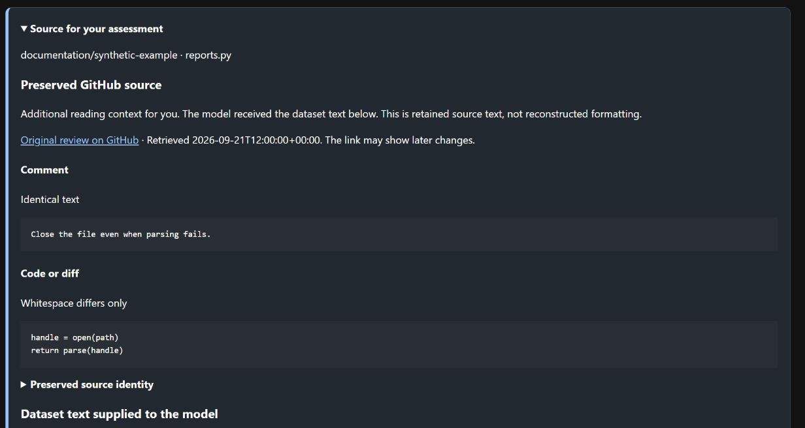

# Read preserved source alongside model input

Some datasets collapse code or diff whitespace. A preserved GitHub response can
make the original easier to read without changing the text the model received.

| View | Use it for |
| --- | --- |
| Preserved GitHub source | Read the retrieved comment and diff with their retained formatting. Check the retrieval date and difference labels. |
| Dataset text supplied to the model | Judge what the model could know and copy exact evidence quotes. |

The response can contain other differences besides whitespace. If those affect
your judgement, explain them in **Assessment notes and evidence limitations**.
Do not attribute facts present only in the preserved view to the model's input.
The model output and dataset records remain unchanged.

Each new saved decision retains the digest of the attached context presented by
its form. This records availability, not proof that you read it. Earlier decisions
are not backfilled. If context was added after you opened a form, keep your edits,
reload the page, read the new context and reapply the edits before saving.



This [synthetic demonstration](../images/README.md) shows the additional reading
view. The dataset text continues below it and remains the source for exact quotes.

## Attach retained evidence

Run from the repository root in the locked Python environment. Use an external
runtime and an existing, unreviewed terminal job. This command does not download
evidence, run models or make a human decision.

```text
uv run --locked python tools/import_source_context.py --data-root <runtime> --job <job-id> --response <response.json> --receipt <receipt.json>
```

| File | Required content |
| --- | --- |
| Response | Exact UTF-8 JSON bytes retained from GitHub's public review-comment endpoint, including `id`, `url`, `html_url`, `pull_request_url`, `path`, `body` and `diff_hunk`. |
| Receipt | UTF-8 JSON containing `url` (requested endpoint), `effective_url`, `http_status` (200), `checked_at` (timezone-aware timestamp) and `response_sha256` (hash of the exact response bytes). |

- Each input is limited to 2 MiB. The command prints the attached context digest.
- The requested endpoint, returned identities and path must match the observation.
  Redirects retain both URLs; they must agree with the response identity.
- Identical re-imports are safe. A different attachment or a new attachment after
  a saved decision is refused. Do not delete or replace existing evidence to retry.
- Missing or corrupt attached files block the assessment. Restore exact verified
  bytes from backup; do not substitute a freshly fetched response under an old hash.

Files live under `<runtime>/source-context`; SQLite holds immutable references and
attachment events. New annotation/event records retain `context_sha256` alongside
the original result identity. These optional references extend the existing record
format; old records have no context. Back up both files and database together.
Retained receipts establish local consistency, not independent authentication of
the source. Source text is escaped and never executed as HTML or instructions.

See [ADR-0015](../adr/ADR-0015-separate-review-context-from-model-input.md) for the
decision and [the assessment guide](assessment-fields.md) for field meanings.
