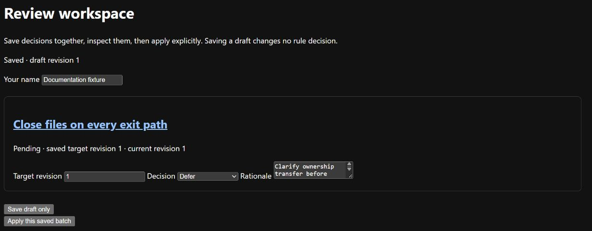
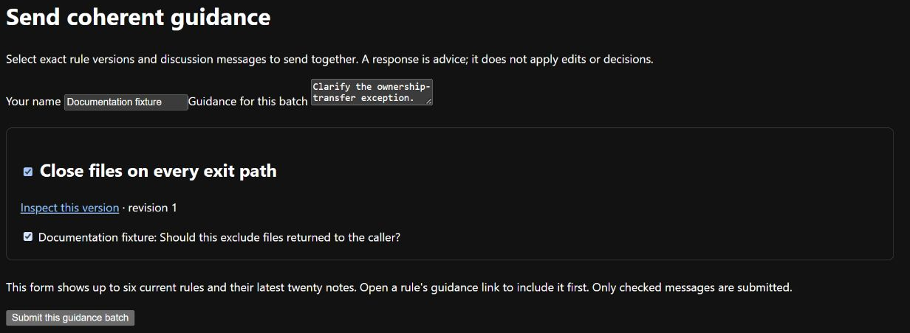

# Save rule decisions and ask for advice

Use **Review workspace** to save several rule decisions before applying them.
Use **Guidance** to send selected discussion to a model for advice. Saving a draft,
posting a message and requesting advice are separate actions.

## Save and apply a draft

Start with candidates in the [rule registry](rules.md).

1. Open **Review workspace**, or a rule's **Stage decisions, defer or reopen** link.
2. Choose actions and rationales for up to twenty rule versions, and enter your name.
3. Choose **Save draft only**. The draft survives restart; rule decisions have not changed.
4. Open the saved draft and inspect its target versions and actions.
5. Choose **Apply this saved batch**. All its decisions and events are saved together.



The [demonstration draft](../images/README.md) is saved, but the rule is still pending.
Saving and applying are separate actions.

If any rule or its evidence changed after you prepared the draft, **none of the
batch is applied**. The page identifies the conflicting version and preserves the
draft. Inspect that rule before correcting the target revision or action and saving
again. An applied draft cannot be edited; start a new one. Repeating an identical
Apply request returns the original receipt.

## Choose the next review action

| Current review state | Meaning | Available next action |
| --- | --- | --- |
| Pending | A new rule version awaits review. | Promote, reject or defer |
| Answered | A promote/reject decision has been recorded. | Reopen before another decision |
| Deferred | Review has been set aside. | Reopen when ready |
| Reopened | Review is active again; earlier answers remain recorded. | Promote, reject or defer |
| Superseded | A newer rule definition replaces this version. | Follow the replacement link to review it |

Reopening returns the rule to candidate status and preserves earlier answers.
Revising the definition creates a new pending task and marks the old one superseded.
Evidence added after a decision is shown as newer than that decision.

Immediate promote/reject on a rule page follows the same rules as batch application.
Promotion retains a research candidate; it does not deploy or validate a detector.
These controls apply to rules. [Source annotations](annotations.md) still save
Accept/Edit/Reject immediately and cannot be reopened.

## Add discussion and send guidance

A message belongs to the exact rule version on which it was posted. It remains
there after a revision. Posting it does not invoke a model or apply a decision.

1. Add a discussion message on a rule page.
2. Open **Guidance**, or use the rule's guidance link to put that rule first.
3. Choose the rule versions and explicitly select the messages to include.
   The form shows up to six rules and the latest twenty messages per rule.
4. Enter one instruction describing the advice you want, then submit.
5. Inspect the saved request and wait for the worker's response. Later messages or
   rule revisions do not enter the request you already sent.



Select both the target rule and the messages to send. This
[demonstration](../images/README.md) is filled in but has not been submitted.

The [discovery worker](discovery.md#start-the-worker) supports guidance. To run only
normalisation and guidance, start the generation server and use this command from
the repository root, after stopping any other worker on the same data directory:

```text
uv run --locked python tools/run.py --data-root ../extras/runtime worker --routing config/routing/discovery-local.json --endpoint http://127.0.0.1:8081
```

This uses the supplied policy version 3 and does not load an embedding runtime.
Model work runs in the worker, outside web requests.

## Read a response or recover a failed request

| State or message | Meaning and next action |
| --- | --- |
| Queued | Waiting for a worker with an eligible route. Check the worker's data directory and routing file. |
| Running | The worker is processing the saved request. Usage refreshes every five seconds. |
| Responded | Advisory text and its source/request history are available. Apply any chosen change yourself through rule review. |
| Failed | Inspect the error and retained output; invalid or invented version references are refused. |
| Unknown | The worker stopped before completion was recorded. It may have finished externally; inspect before making a new explicit submission. |
| Historical context | A target has changed since submission. Compare the advice with the current rule before acting. |
| Context too large | Reduce the selected material. Requests above 18,000 characters are refused; the model's token limit is checked separately. |

No response edits a rule or applies a decision. Recovery never automatically
resends. Duplicate requests with the same identity and content return the existing
batch; changed content requires a new request. Stale targets are refused before queueing.

Names and rationales are local claims, not authenticated identities. Submitted
context and responses are immutable external files; SQLite holds queue metadata,
small claims, receipts and events. See [operational evidence](operational-evidence.md)
for the distinction between stored output and a successful operation.
