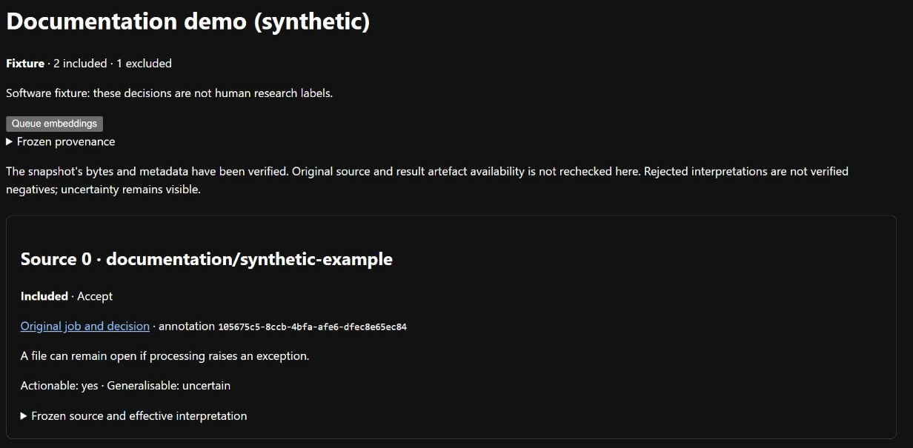

# Save fixed inputs for discovery

A *selection* is a saved copy of explicitly chosen annotations and their source
material. It records which interpretation to use and which records to exclude.
Later annotations cannot change an existing selection.

## Create a selection

You need reviewed results from the [annotation workflow](annotations.md). No model
server or worker is needed for these commands.

1. Open each reviewed job and copy its annotation ID. Choose one annotation version
   per source record, all from the same dataset.
2. Save a request outside the repository, for example `../extras/selection-request.json`:

   ```json
   {
     "dataset_id": "crc-py-manual-4176ac0",
     "annotation_ids": ["replace-with-an-actual-annotation-id"],
     "purpose": "fixture",
     "holdout_repositories": []
   }
   ```

   `fixture` means software-test data. Use it while trying the workflow; do not
   describe these inputs as a human-labelled research sample.
3. From the repository root, register the selection using the annotation data directory:

   ```text
   uv run --locked python tools/run.py --data-root ../extras/runtime freeze-selection ../extras/selection-request.json
   ```

4. Copy the returned selection ID. The response also gives included/excluded totals
   and the first registration time. Inspect the complete saved content with:

   ```text
   uv run --locked python tools/run.py --data-root ../extras/runtime selection <selection-id>
   ```

5. Open **Frozen annotation inputs** in the web application and select that ID.
   It checks the stored content and displays ten records per page. The catalogue
   itself lists metadata; opening a selection verifies its body.

## Understand inclusion and exclusion



Check the included/excluded totals and follow **Original job and decision** to inspect
an input. This [synthetic selection](../images/README.md) is explicitly labelled Fixture.

| Input | Treatment |
| --- | --- |
| Accepted annotation | Include the original model interpretation. |
| Edited annotation | Include the verified edit and retain the original result hash, including when the original model draft failed validation. |
| Rejected annotation | Exclude the interpretation. Rejection does not prove the source is a valid negative example. |
| Repository listed as a holdout | Exclude it even if accepted; repository matching ignores case. |
| Rejected and held out | Show the holdout exclusion and retain the Reject decision. |

A *holdout* is material reserved from the current discovery work for later evaluation.
The request declares holdouts; the application does not discover them for you.
Selecting a holdout still reads and retains its source, so record that exposure.
An all-excluded selection can be saved but cannot supply discovery inputs.
A rejected failed draft has no valid interpretation: its decision and exclusion
remain visible without inventing one. New snapshots use version 2; existing
version 1 snapshots remain readable.

## Use human-reviewed data

For a research selection, set these fields in addition to the dataset and annotation IDs:

```json
{
  "purpose": "research",
  "curator": "Name of the person confirming review",
  "human_review_attested": true
}
```

- This records the curator's claim that the included decisions were human-reviewed.
  The application does not authenticate that claim.
- Do not attest automated test decisions. Fixture selections cannot carry this attestation.
- Before a decision-bearing comparison, register its sample, splits, methods and
  contamination controls using the [EDR process](../edr/README.md).

## Limits and recovery

| Condition | Behaviour or action |
| --- | --- |
| Request exceeds 256 KB, 100 distinct annotations or one dataset | Reduce or correct the request. |
| Saved snapshot exceeds 32 MB | Reduce the explicit selection; nothing is silently truncated. |
| Same request is retried | Return the first identity/time without a duplicate event. Input order and curator details are part of identity. |
| Request content changes | Create a different selection; existing content is not replaced. |
| Source evidence is missing or corrupt | Freezing fails. Restore verified evidence before retrying. |
| Saved snapshot is missing or corrupt | Inspection/retry fails; restore trusted bytes rather than editing it in place. |

Bodies live at `<data-root>/selections/<sha256>.json`; SQLite contains small metadata
and events. Files are published before the metadata transaction, so interruption
may leave a complete unreferenced file. Retry registration rather than overwriting it.

Keep original source, result and edit files for full reproduction. A selection can
still show its copied content if originals are offline; that does not establish
that every original artefact remains available. See
[ADR-0009: Freeze explicit annotation selections before discovery](../adr/ADR-0009-freeze-explicit-annotation-selections.md)
for the implemented retention decision.
