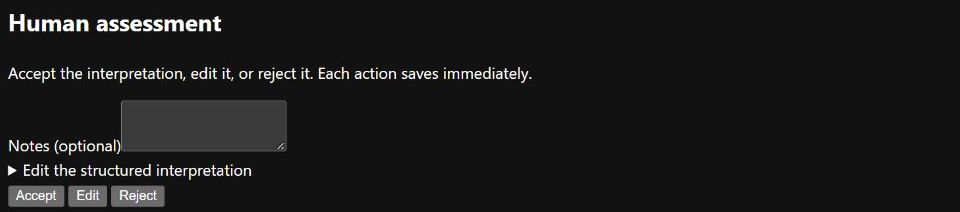

# Prepare a human-reviewed grouping study

This guide separates preparing trustworthy inputs from judging the groups produced
by a method. The project's first grouping study has an agreed protocol but is not
registered. Its exact
sample, methods and decision criteria belong in
[EDR-0001](../edr/0001-discovery-grouping-method.md#concrete-proposal-for-owner-review).
The comparison runner and rating pack are not available yet.

## Agree the study before preparing inputs

1. Read the EDR's proposed workload, sampling procedure, rating rubric and decision rule.
2. The owner agrees or amends those choices. Record the agreement and any prior
   exposure to the source material; software PR approval alone does not supply it.
3. The agent prepares the source order, repository holdout list and exclusion log
   according to that procedure, before generating or judging interpretations.
4. Verify selected source identities and access terms. Keep unresolved sources out
   of the research sample with recorded reasons; retain the original imported data.
5. Freeze the normalisation configuration and choose a dedicated external data
   directory. Use it consistently for the web application and worker. Keep software
   test decisions separate from human research annotations.

The agent can build and test the comparison tooling with synthetic fixtures while
the owner reviews inputs. Synthetic tests cannot supply missing human judgements.

## Create the fixed input order

Use `tools/study_inputs.py` from the repository root. It runs no models and makes
no human decisions. Keep its output files in a dedicated directory outside Git.

1. Obtain the pinned source file using the [dataset guide](datasets.md). Keep the
   original bytes; do not edit them to remove duplicates or correct source records.
2. Record any additional prior exposure with repeated `--exposed-repository owner/name`
   arguments. The two known pilot repositories are always excluded.
3. Create the first record, using the SHA-256 from the dataset manifest:

   ```powershell
   uv run --locked python tools/study_inputs.py --source D:/research/source.json plan --source-sha256 a36405b45b65f6a193a12e15bb9c600d6c0f46d84eb4dc891f315248a7cade83 --output D:/research/study-inputs/0000.json
   ```

4. Retain that file before reading candidate source material or producing
   interpretations. It contains the holdout list, ordered candidates and a reason
   for every excluded index. Code and comment text are absent from the output;
   the tool hashes them only to detect exact duplicates.
5. Freeze the normalisation model, prompt, routing configuration and runtime
   location before beginning input review. Retain the exact code revision and
   environment used to prepare the sample.

The procedure reserves repositories before deduplication. Duplicate identity or
identical code/comment pairs retain the lowest original index across the source;
an earlier excluded record does not make its duplicate eligible. Identity comparison
ignores repository-name case; text comparison is exact. Duplicate exclusions happen
before the seeded round-robin order. The resulting pool contains at most 80 positions,
at most ten per repository. A later repository-quota skip still consumes its position;
the tool never quietly replaces it with a candidate outside that fixed pool.

## Record source checks and review outcomes

For each next candidate:

1. Verify its claimed repository, PR/comment and usable context against the original
   public source. Retain the response or a dated verification record outside Git.
   Record unresolved access, mismatches and preprocessing separately; a plausible
   repository name or an HTTP success alone does not verify a comment.
2. If usable, run normalisation once with the fixed configuration, then ask the
   human reviewer to Accept, Edit or Reject through the existing annotation controls.
   Keep failed jobs and rejected interpretations.
3. Write one terminal attempt as JSON. For example, an unresolved source uses:

   ```json
   {
     "source_index": 123,
     "outcome": "source_unresolved",
     "recorded_by": "Name of recorder",
     "reason": "Explain the unresolved origin or access limitation.",
     "source_reference": "Original URL checked",
     "source_evidence_sha256": "SHA-256 of the retained response or verification record",
     "source_check": "What was checked, when, and what remained unresolved"
   }
   ```

   Replace the example values with the actual next index and evidence. The digest
   must be 64 hexadecimal characters. Do not mark an outcome before it happens.
4. Append it by creating a new file; existing records cannot be overwritten:

   ```powershell
   uv run --locked python tools/study_inputs.py --source D:/research/source.json record D:/research/study-inputs/0000.json D:/research/attempt.json --output D:/research/study-inputs/0001.json
   ```

5. Continue from the returned `next_candidate`. Keep every numbered file: each new
   record includes the full attempt sequence and the previous file's SHA-256.
   Use `progress D:/research/study-inputs/0001.json` with the same `--source` to
   check the plan and counts again.

| Outcome | Additional fields and meaning |
| --- | --- |
| `source_unresolved` | Source could not be verified; retain reference, evidence digest and check notes. |
| `context_unusable` | Origin checked, but supplied context cannot support interpretation; explain why. |
| `normalisation_failed` | Source checked; `job_id` identifies the one failed normalisation attempt. |
| `accept`, `edit`, `reject` | Source checked; provide `job_id`, exact `annotation_id` and `human_reviewer`. Rejection remains in the log but does not count towards the target. |
| `repository_quota` | Required once that repository has five usable reviews; no source, job or human-review fields. The candidate is skipped without inspection. |

Every outcome needs `source_index`, `recorded_by` and `reason`. All except quota
skips also need `source_reference`, `source_evidence_sha256` and `source_check`.
The tool checks order, required evidence fields, duplicate job/annotation identities
and limits. It does **not** authenticate the recorder, fetch URLs, verify evidence
files or establish that a claimed human review occurred. Cross-check those records
and exact annotation versions before freezing the research selection. The predecessor
hash supports an audit against retained files; reading one record alone does not
verify the whole file chain. Preserve mistaken records and document corrections;
do not rewrite them or silently branch the preparation history.

| Reported state | Next action |
| --- | --- |
| `pending` | Complete the next candidate. A paused or failed command is not an exclusion. |
| `ready` | Forty usable reviews recorded; stop input preparation and verify the final selection. This does not register the study. |
| `shortfall` | Fixed pool exhausted before forty usable reviews; stop and revise the draft prospectively. Do not extend the pool or supply automated labels. |

## Review each interpretation

Use the existing [normalisation workflow](normalisation.md) to produce the queued
interpretations and [annotation controls](annotations.md) to record your review.
Work through the prepared order; do not choose only promising-looking concerns.



These are the existing input-review controls, shown with
[synthetic demonstration data](../images/README.md). They are not the proposed
group-rating interface, and these example decisions do not enter the study.

| Step | What the human reviewer checks |
| --- | --- |
| Read the source | Read the supplied comment and code, with the verified original reference where available. Distinguish preprocessed text from the original. |
| Check meaning | Does the interpretation accurately describe the concern, rather than invent an unstated requirement? |
| Check evidence | Do the quoted excerpts support its claims? Is uncertainty or limited applicability retained? |
| Accept | Use when the existing interpretation is usable as written. This does not validate a future rule or detector. |
| Edit | Correct a usable interpretation while keeping it grounded in the supplied source. Save the edited structured result. |
| Reject | Use when the interpretation cannot serve the study. Record a short reason; rejection is not a verified negative example. |

Keep failures and skipped records in the preparation log. Follow the EDR's cap and
shortfall rule; do not quietly add more sources or rerun models for preferred answers.
If a saved annotation is mistaken, preserve it and record the correction explicitly
before freezing the selected version. The source-annotation UI cannot reopen it.

## Freeze and register

| Handoff | Agent prepares | Human contribution |
| --- | --- | --- |
| Input selection | Exact annotation IDs, verified result/edit hashes, source identities, duplicate/exposure/holdout exclusions and a fixed selection | Confirm which decisions were genuinely human-reviewed; give the curator name for the attestation |
| Reproduction | Tested runner, fixed methods/configuration, commands, environment, output identities and synthetic failure checks | Review consequential changes to the agreed method |
| Registration | Completed EDR plan commit, then a second commit recording that SHA, registration date and status | Agreement on the plan; no group ratings collected early |

Follow the [selection guide](selections.md#use-human-reviewed-data) and
[EDR registration process](../edr/README.md#follow-the-process). Registration requires
actual identities and working methods. A proposed filename or blank field is insufficient.

## Rate groups after registration

1. The agent runs the two registered configurations and prepares the method-masked pack.
2. Read all members in each presented group. Use the EDR rubric to record coherent,
   not coherent or uncertain, with a short reason.
3. Complete the selected ratings before seeing method identities or comparative scores.
   Record any suspected unmasking or missing information.
4. The agent freezes the ratings, reveals the mapping and reports counts, coverage,
   failures, costs where available and limitations.
5. The owner records adoption, no adoption or the next action for inconclusive evidence.
   Any implementation change and full slice closure are recorded separately.

Keep large or restricted inputs and raw outputs outside source control. Share a
small permitted summary, methods, hashes and access instructions. State reproduction
limits explicitly; one person's ratings are not independent agreement between raters.
